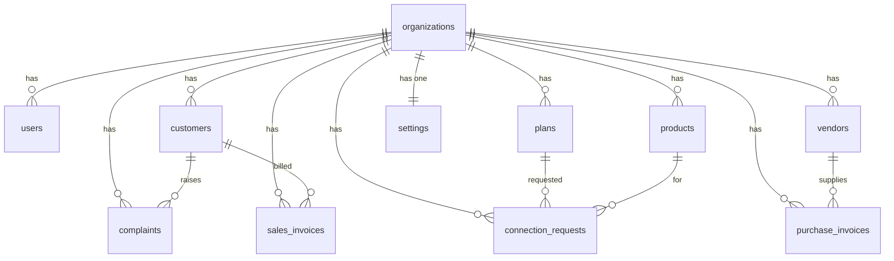

# 🗄️ POPNA Backend — Database Tables & API Specification

> Complete backend specification extracted from your frontend codebase. Every table and API maps directly to your existing React code.

---

## Summary

| Category | Count |
|---|---|
| **Database Tables** | **11** |
| **API Endpoints** | **44** |
| **Auth Endpoints** | **4** |
| **Total** | **11 Tables, 48 APIs** |

---

## 📊 Database Tables (11 Total)

### Table 1: `organizations`
> Multi-tenancy root table — all other tables reference this via `organization_id`.

| Column | Type | Constraints | Notes |
|---|---|---|---|
| `id` | `UUID / SERIAL` | PK | Primary key |
| `name` | `VARCHAR(255)` | NOT NULL | e.g., "BankaiTech" |
| `slug` | `VARCHAR(100)` | UNIQUE, NOT NULL | URL-friendly identifier |
| `created_at` | `TIMESTAMP` | DEFAULT NOW() | |
| `updated_at` | `TIMESTAMP` | DEFAULT NOW() | |

> [!NOTE]
> Your code uses `MOCK_ORGANIZATION_ID = 'org_001'`. Every table below has `organization_id` as a foreign key to this table for tenant isolation.

**Source:** [types.ts#L22](file:///f:/Projects/popna-react/src/models/types.ts#L22)

---

### Table 2: `users`
> Admin & Employee accounts for the management panel.

| Column | Type | Constraints | Notes |
|---|---|---|---|
| `id` | `SERIAL` | PK | |
| `organization_id` | `VARCHAR` | FK → organizations | |
| `name` | `VARCHAR(255)` | NOT NULL | Display name |
| `username` | `VARCHAR(100)` | UNIQUE per org, NOT NULL | Login username |
| `password_hash` | `VARCHAR(255)` | NOT NULL | ⚠️ Currently plain text in mock — **must hash** |
| `role` | `ENUM('admin','employee')` | NOT NULL | |
| `status` | `ENUM('active','inactive')` | DEFAULT 'active' | |
| `created_at` | `TIMESTAMP` | DEFAULT NOW() | |

**Source:** [types.ts#L107-L116](file:///f:/Projects/popna-react/src/models/types.ts#L107-L116) → [users.ts](file:///f:/Projects/popna-react/src/api/users.ts)

---

### Table 3: `customers`
> End-user customer accounts (cable/internet subscribers).

| Column | Type | Constraints | Notes |
|---|---|---|---|
| `id` | `SERIAL` | PK | |
| `organization_id` | `VARCHAR` | FK → organizations | |
| `name` | `VARCHAR(255)` | NOT NULL | |
| `email` | `VARCHAR(255)` | | |
| `mobile` | `VARCHAR(15)` | NOT NULL, UNIQUE per org | Used as login identifier |
| `password_hash` | `VARCHAR(255)` | | ⚠️ Currently plain text — **must hash** |
| `connection_type` | `VARCHAR(50)` | NOT NULL | References product name (e.g., "Cable", "Internet 1") |
| `package` | `VARCHAR(100)` | NOT NULL | Plan name subscribed to |
| `status` | `ENUM('Active','Inactive')` | DEFAULT 'Active' | |
| `description` | `TEXT` | NULLABLE | |
| `address_line1` | `VARCHAR(255)` | NOT NULL | |
| `address_line2` | `VARCHAR(255)` | | |
| `city` | `VARCHAR(100)` | NOT NULL | |
| `state` | `VARCHAR(100)` | NOT NULL | |
| `country` | `VARCHAR(100)` | DEFAULT 'India' | |
| `payment_status` | `ENUM('paid','not_paid')` | NULLABLE | Cable (GTPL) only |
| `payment_description` | `TEXT` | NULLABLE | Cable only |
| `payment_updated_at` | `TIMESTAMP` | NULLABLE | Cable only |
| `gstin` | `VARCHAR(20)` | NULLABLE | For GST invoicing |
| `created_at` | `TIMESTAMP` | DEFAULT NOW() | |

> [!IMPORTANT]
> The `address` is stored as a nested object in TypeScript (`Address` interface) but should be **flattened into columns** in the database for query performance.

**Source:** [types.ts#L44-L64](file:///f:/Projects/popna-react/src/models/types.ts#L44-L64) → [api.ts (customersApi)](file:///f:/Projects/popna-react/src/api/api.ts#L52-L88)

---

### Table 4: `products`
> Service categories managed by admin (e.g., "Cable", "Internet 1", "Internet 2").

| Column | Type | Constraints | Notes |
|---|---|---|---|
| `id` | `SERIAL` | PK | |
| `organization_id` | `VARCHAR` | FK → organizations | |
| `name` | `VARCHAR(100)` | NOT NULL, UNIQUE per org | e.g., "Cable", "Internet 1" |
| `product_type` | `ENUM('cable','internet')` | NOT NULL | |
| `is_active` | `BOOLEAN` | DEFAULT true | |
| `created_at` | `TIMESTAMP` | DEFAULT NOW() | |

**Source:** [types.ts#L164-L171](file:///f:/Projects/popna-react/src/models/types.ts#L164-L171) → [products.ts](file:///f:/Projects/popna-react/src/api/products.ts)

---

### Table 5: `plans`
> Subscription plans offered under each product/service.

| Column | Type | Constraints | Notes |
|---|---|---|---|
| `id` | `SERIAL` | PK | |
| `organization_id` | `VARCHAR` | FK → organizations | |
| `provider` | `VARCHAR(50)` | NOT NULL | Maps to product name |
| `plan_name` | `VARCHAR(255)` | NOT NULL | |
| `image_url` | `TEXT` | | Plan banner/image |
| `price` | `DECIMAL(10,2)` | NOT NULL | Base price before GST |
| `gst_rate` | `DECIMAL(5,2)` | NOT NULL | GST percentage (e.g., 18) |
| `installation_amount` | `DECIMAL(10,2)` | DEFAULT 0 | One-time installation fee |
| `description` | `TEXT` | | |

**Source:** [types.ts#L24-L34](file:///f:/Projects/popna-react/src/models/types.ts#L24-L34) → [api.ts (plansApi)](file:///f:/Projects/popna-react/src/api/api.ts#L12-L50)

---

### Table 6: `complaints`
> Customer service complaints/tickets.

| Column | Type | Constraints | Notes |
|---|---|---|---|
| `id` | `SERIAL` | PK | |
| `organization_id` | `VARCHAR` | FK → organizations | |
| `customer_id` | `INT` | FK → customers | |
| `customer_name` | `VARCHAR(255)` | NOT NULL | Denormalized for display |
| `mobile` | `VARCHAR(15)` | NOT NULL | |
| `connection_type` | `VARCHAR(50)` | NOT NULL | Product/service type |
| `customer_description` | `TEXT` | NOT NULL | Customer's complaint text |
| `internal_description` | `TEXT` | NULLABLE | Admin/employee internal notes |
| `status` | `ENUM('active','on-hold','completed')` | DEFAULT 'active' | |
| `closure_image` | `TEXT` | NULLABLE | ⚠️ Currently base64 — **use file storage URL** |
| `closed_at` | `TIMESTAMP` | NULLABLE | When complaint was resolved |
| `created_at` | `TIMESTAMP` | DEFAULT NOW() | |

**Source:** [types.ts#L89-L104](file:///f:/Projects/popna-react/src/models/types.ts#L89-L104) → [complaints.ts](file:///f:/Projects/popna-react/src/api/complaints.ts)

---

### Table 7: `sales_invoices`
> Invoices generated for customer billing.

| Column | Type | Constraints | Notes |
|---|---|---|---|
| `id` | `SERIAL` | PK | |
| `organization_id` | `VARCHAR` | FK → organizations | |
| `invoice_number` | `VARCHAR(50)` | UNIQUE per org | e.g., "INV-2024-001" |
| `customer_id` | `INT` | FK → customers | |
| `customer_name` | `VARCHAR(255)` | | Denormalized |
| `service_provider` | `VARCHAR(50)` | | Product/service name |
| `plan_name` | `VARCHAR(255)` | | |
| `amount` | `DECIMAL(10,2)` | NOT NULL | Base amount |
| `gst_rate` | `DECIMAL(5,2)` | NOT NULL | GST % |
| `gst_amount` | `DECIMAL(10,2)` | NOT NULL | Calculated GST |
| `total_amount` | `DECIMAL(10,2)` | NOT NULL | amount + gst_amount |
| `status` | `ENUM('draft','sent','paid','overdue')` | DEFAULT 'draft' | |
| `issue_date` | `DATE` | NOT NULL | |
| `due_date` | `DATE` | NOT NULL | |
| `created_at` | `TIMESTAMP` | DEFAULT NOW() | |

**Source:** [types.ts#L121-L137](file:///f:/Projects/popna-react/src/models/types.ts#L121-L137) → [invoices.ts](file:///f:/Projects/popna-react/src/api/invoices.ts)

---

### Table 8: `vendors`
> Suppliers/vendors for purchase invoicing.

| Column | Type | Constraints | Notes |
|---|---|---|---|
| `id` | `SERIAL` | PK | |
| `organization_id` | `VARCHAR` | FK → organizations | |
| `name` | `VARCHAR(255)` | NOT NULL | |
| `contact` | `VARCHAR(15)` | NULLABLE | Phone number |
| `gstin` | `VARCHAR(20)` | NULLABLE | Vendor GST number |
| `address_line1` | `VARCHAR(255)` | NULLABLE | |
| `address_line2` | `VARCHAR(255)` | NULLABLE | |
| `city` | `VARCHAR(100)` | NULLABLE | |
| `state` | `VARCHAR(100)` | NULLABLE | |
| `country` | `VARCHAR(100)` | DEFAULT 'India' | |
| `pincode` | `VARCHAR(10)` | NULLABLE | |
| `created_at` | `TIMESTAMP` | DEFAULT NOW() | |

> [!NOTE]
> The `Vendor` interface in `types.ts` has fewer fields than the mock data in `purchaseInvoices.ts`. The mock data includes address fields not in the interface — listed above for completeness.

**Source:** [types.ts#L154-L161](file:///f:/Projects/popna-react/src/models/types.ts#L154-L161) → [purchaseInvoices.ts (vendorsApi)](file:///f:/Projects/popna-react/src/api/purchaseInvoices.ts#L108-L132)

---

### Table 9: `purchase_invoices`
> Invoices received from vendors/suppliers.

| Column | Type | Constraints | Notes |
|---|---|---|---|
| `id` | `SERIAL` | PK | |
| `organization_id` | `VARCHAR` | FK → organizations | |
| `invoice_number` | `VARCHAR(50)` | UNIQUE per org | e.g., "PINV-2024-001" |
| `vendor_id` | `INT` | FK → vendors | |
| `vendor_name` | `VARCHAR(255)` | | Denormalized |
| `reference` | `VARCHAR(100)` | NULLABLE | PO/GRN reference |
| `amount` | `DECIMAL(10,2)` | NOT NULL | |
| `cgst` | `DECIMAL(10,2)` | NULLABLE | Central GST |
| `sgst` | `DECIMAL(10,2)` | NULLABLE | State GST |
| `igst` | `DECIMAL(10,2)` | NULLABLE | Integrated GST |
| `total_amount` | `DECIMAL(10,2)` | NOT NULL | |
| `issue_date` | `DATE` | NOT NULL | |
| `created_at` | `TIMESTAMP` | DEFAULT NOW() | |

> [!TIP]
> The `gstBreakup` nested object `{ cgst?, sgst?, igst? }` is flattened into separate columns for easier SQL queries and calculations.

**Source:** [types.ts#L140-L152](file:///f:/Projects/popna-react/src/models/types.ts#L140-L152) → [purchaseInvoices.ts](file:///f:/Projects/popna-react/src/api/purchaseInvoices.ts)

---

### Table 10: `connection_requests`
> Public-facing plan request forms from prospective customers.

| Column | Type | Constraints | Notes |
|---|---|---|---|
| `id` | `SERIAL` | PK | |
| `organization_id` | `VARCHAR` | FK → organizations | |
| `name` | `VARCHAR(255)` | NOT NULL | Requester name |
| `mobile` | `VARCHAR(15)` | NOT NULL | |
| `email` | `VARCHAR(255)` | NULLABLE | |
| `package_id` | `INT` | FK → plans | Plan they want |
| `product_id` | `INT` | FK → products | Product category |
| `plan_name` | `VARCHAR(255)` | | Denormalized |
| `product_name` | `VARCHAR(100)` | | Denormalized |
| `status` | `ENUM('New','Contacted','Converted')` | DEFAULT 'New' | |
| `created_at` | `TIMESTAMP` | DEFAULT NOW() | |

**Source:** [types.ts#L212-L224](file:///f:/Projects/popna-react/src/models/types.ts#L212-L224) → [connectionRequests.ts](file:///f:/Projects/popna-react/src/api/connectionRequests.ts)

---

### Table 11: `settings`
> Combined table for Company Profile + Website Settings (one row per org).

| Column | Type | Constraints | Notes |
|---|---|---|---|
| `id` | `SERIAL` | PK | |
| `organization_id` | `VARCHAR` | FK → organizations, UNIQUE | One row per org |
| **Company Profile** |
| `company_name` | `VARCHAR(255)` | | |
| `gstin` | `VARCHAR(20)` | | Company GST number |
| `address_line1` | `VARCHAR(255)` | | |
| `address_line2` | `VARCHAR(255)` | | |
| `city` | `VARCHAR(100)` | | |
| `state` | `VARCHAR(100)` | | |
| `country` | `VARCHAR(100)` | DEFAULT 'India' | |
| `pincode` | `VARCHAR(10)` | | |
| `contact_number` | `VARCHAR(20)` | | |
| `email` | `VARCHAR(255)` | | |
| **Website Settings** |
| `hero_title` | `VARCHAR(255)` | | |
| `hero_subtitle` | `VARCHAR(255)` | | |
| `hero_description` | `TEXT` | | |
| `hero_image` | `TEXT` | NULLABLE | Image URL |
| `highlight_section_title` | `VARCHAR(255)` | | |
| `highlight_cards` | `JSONB` | | Array of `{ title, description, icon }` |
| `cta_button_text` | `VARCHAR(100)` | | |
| `cta_button_link` | `VARCHAR(255)` | | |
| `updated_at` | `TIMESTAMP` | DEFAULT NOW() | |

> [!TIP]
> CompanyProfile and WebsiteSettings are both **single-record-per-org** settings. They can be one table or two. Combined here for simplicity since both follow a get/update pattern.

**Source:** [types.ts#L174-L209](file:///f:/Projects/popna-react/src/models/types.ts#L174-L209) → [companyProfile.ts](file:///f:/Projects/popna-react/src/api/companyProfile.ts) + [websiteSettings.ts](file:///f:/Projects/popna-react/src/api/websiteSettings.ts)

---

## 🗺️ Entity Relationship Diagram

---

## 🔌 API Endpoints (48 Total)

### 1. Auth APIs (4 endpoints)

| # | Method | Endpoint | Description | Frontend Source |
|---|---|---|---|---|
| 1 | `POST` | `/api/auth/admin/login` | Admin/Employee login (username + password) | [useAuthStore.ts#L85](file:///f:/Projects/popna-react/src/store/useAuthStore.ts#L85) |
| 2 | `POST` | `/api/auth/customer/login` | Customer login (mobile + password) | [customerAuth.ts#L25](file:///f:/Projects/popna-react/src/api/customerAuth.ts#L25) |
| 3 | `POST` | `/api/auth/logout` | Clear session/token | [useAuthStore.ts#L133](file:///f:/Projects/popna-react/src/store/useAuthStore.ts#L133) |
| 4 | `GET` | `/api/auth/me` | Get current user profile from token | [useAuthStore.ts#L149](file:///f:/Projects/popna-react/src/store/useAuthStore.ts#L149) |

---

### 2. Users API (3 endpoints)

| # | Method | Endpoint | Description | Frontend Source |
|---|---|---|---|---|
| 5 | `GET` | `/api/users` | List all admin/employee users | [users.ts#L14](file:///f:/Projects/popna-react/src/api/users.ts#L14) |
| 6 | `POST` | `/api/users` | Create new admin/employee | [users.ts#L19](file:///f:/Projects/popna-react/src/api/users.ts#L19) |
| 7 | `PUT` | `/api/users/:id` | Update user (role, status, password) | [users.ts#L36](file:///f:/Projects/popna-react/src/api/users.ts#L36) |

---

### 3. Customers API (5 endpoints)

| # | Method | Endpoint | Description | Frontend Source |
|---|---|---|---|---|
| 8 | `GET` | `/api/customers` | List all customers | [api.ts#L54](file:///f:/Projects/popna-react/src/api/api.ts#L54) |
| 9 | `GET` | `/api/customers/:id` | Get customer by ID | [api.ts#L58](file:///f:/Projects/popna-react/src/api/api.ts#L58) |
| 10 | `POST` | `/api/customers` | Create new customer | [api.ts#L64](file:///f:/Projects/popna-react/src/api/api.ts#L64) |
| 11 | `PUT` | `/api/customers/:id` | Update customer (including payment status) | [api.ts#L74](file:///f:/Projects/popna-react/src/api/api.ts#L74) |
| 12 | `DELETE` | `/api/customers/:id` | Delete customer | [api.ts#L81](file:///f:/Projects/popna-react/src/api/api.ts#L81) |

---

### 4. Products API (6 endpoints)

| # | Method | Endpoint | Description | Frontend Source |
|---|---|---|---|---|
| 13 | `GET` | `/api/products` | List all products | [products.ts#L15](file:///f:/Projects/popna-react/src/api/products.ts#L15) |
| 14 | `GET` | `/api/products/active` | List active products only | [products.ts#L19](file:///f:/Projects/popna-react/src/api/products.ts#L19) |
| 15 | `GET` | `/api/products/:id` | Get product by ID | [products.ts#L23](file:///f:/Projects/popna-react/src/api/products.ts#L23) |
| 16 | `POST` | `/api/products` | Create product | [products.ts#L28](file:///f:/Projects/popna-react/src/api/products.ts#L28) |
| 17 | `PUT` | `/api/products/:id` | Update product | [products.ts#L38](file:///f:/Projects/popna-react/src/api/products.ts#L38) |
| 18 | `DELETE` | `/api/products/:id` | Delete product | [products.ts#L44](file:///f:/Projects/popna-react/src/api/products.ts#L44) |

---

### 5. Plans API (6 endpoints)

| # | Method | Endpoint | Description | Frontend Source |
|---|---|---|---|---|
| 19 | `GET` | `/api/plans` | List all plans | [api.ts#L13](file:///f:/Projects/popna-react/src/api/api.ts#L13) |
| 20 | `GET` | `/api/plans?provider=:name` | Filter plans by provider/product | [api.ts#L17](file:///f:/Projects/popna-react/src/api/api.ts#L17) |
| 21 | `GET` | `/api/plans/:id` | Get plan by ID | [api.ts#L21](file:///f:/Projects/popna-react/src/api/api.ts#L21) |
| 22 | `POST` | `/api/plans` | Create plan | [api.ts#L27](file:///f:/Projects/popna-react/src/api/api.ts#L27) |
| 23 | `PUT` | `/api/plans/:id` | Update plan | [api.ts#L36](file:///f:/Projects/popna-react/src/api/api.ts#L36) |
| 24 | `DELETE` | `/api/plans/:id` | Delete plan | [api.ts#L43](file:///f:/Projects/popna-react/src/api/api.ts#L43) |

---

### 6. Complaints API (6 endpoints)

| # | Method | Endpoint | Description | Frontend Source |
|---|---|---|---|---|
| 25 | `GET` | `/api/complaints` | List all complaints | [complaints.ts#L10](file:///f:/Projects/popna-react/src/api/complaints.ts#L10) |
| 26 | `GET` | `/api/complaints/:id` | Get complaint by ID | [complaints.ts#L14](file:///f:/Projects/popna-react/src/api/complaints.ts#L14) |
| 27 | `POST` | `/api/complaints` | Create complaint | [complaints.ts#L20](file:///f:/Projects/popna-react/src/api/complaints.ts#L20) |
| 28 | `PUT` | `/api/complaints/:id` | Update complaint (status, closure image) | [complaints.ts#L30](file:///f:/Projects/popna-react/src/api/complaints.ts#L30) |
| 29 | `DELETE` | `/api/complaints/:id` | Delete complaint | [complaints.ts#L37](file:///f:/Projects/popna-react/src/api/complaints.ts#L37) |
| 30 | `GET` | `/api/complaints/active/count` | Get active complaint count | [complaints.ts#L44](file:///f:/Projects/popna-react/src/api/complaints.ts#L44) |

---

### 7. Sales Invoices API (5 endpoints)

| # | Method | Endpoint | Description | Frontend Source |
|---|---|---|---|---|
| 31 | `GET` | `/api/invoices` | List all sales invoices | [invoices.ts#L67](file:///f:/Projects/popna-react/src/api/invoices.ts#L67) |
| 32 | `GET` | `/api/invoices/:id` | Get invoice by ID | [invoices.ts#L68](file:///f:/Projects/popna-react/src/api/invoices.ts#L68) |
| 33 | `POST` | `/api/invoices` | Create invoice | [invoices.ts#L73](file:///f:/Projects/popna-react/src/api/invoices.ts#L73) |
| 34 | `PUT` | `/api/invoices/:id` | Update invoice (status, etc.) | [invoices.ts#L83](file:///f:/Projects/popna-react/src/api/invoices.ts#L83) |
| 35 | `GET` | `/api/invoices/:id/pdf` | Download invoice PDF | [invoices.ts#L93](file:///f:/Projects/popna-react/src/api/invoices.ts#L93) |

---

### 8. Purchase Invoices API (4 endpoints)

| # | Method | Endpoint | Description | Frontend Source |
|---|---|---|---|---|
| 36 | `GET` | `/api/purchase-invoices` | List all purchase invoices | [purchaseInvoices.ts#L79](file:///f:/Projects/popna-react/src/api/purchaseInvoices.ts#L79) |
| 37 | `GET` | `/api/purchase-invoices/:id` | Get purchase invoice by ID | [purchaseInvoices.ts#L80](file:///f:/Projects/popna-react/src/api/purchaseInvoices.ts#L80) |
| 38 | `POST` | `/api/purchase-invoices` | Create purchase invoice | [purchaseInvoices.ts#L85](file:///f:/Projects/popna-react/src/api/purchaseInvoices.ts#L85) |
| 39 | `GET` | `/api/purchase-invoices/:id/pdf` | Download purchase invoice PDF | [purchaseInvoices.ts#L99](file:///f:/Projects/popna-react/src/api/purchaseInvoices.ts#L99) |

---

### 9. Vendors API (4 endpoints)

| # | Method | Endpoint | Description | Frontend Source |
|---|---|---|---|---|
| 40 | `GET` | `/api/vendors` | List all vendors | [purchaseInvoices.ts#L111](file:///f:/Projects/popna-react/src/api/purchaseInvoices.ts#L111) |
| 41 | `GET` | `/api/vendors/:id` | Get vendor by ID | [purchaseInvoices.ts#L112](file:///f:/Projects/popna-react/src/api/purchaseInvoices.ts#L112) |
| 42 | `POST` | `/api/vendors` | Create vendor | [purchaseInvoices.ts#L116](file:///f:/Projects/popna-react/src/api/purchaseInvoices.ts#L116) |
| 43 | `PUT` | `/api/vendors/:id` | Update vendor | [purchaseInvoices.ts#L126](file:///f:/Projects/popna-react/src/api/purchaseInvoices.ts#L126) |

---

### 10. Connection Requests API (5 endpoints)

| # | Method | Endpoint | Description | Frontend Source |
|---|---|---|---|---|
| 44 | `GET` | `/api/connection-requests` | List all requests | [connectionRequests.ts#L143](file:///f:/Projects/popna-react/src/api/connectionRequests.ts#L143) |
| 45 | `GET` | `/api/connection-requests/:id` | Get request by ID | [connectionRequests.ts#L151](file:///f:/Projects/popna-react/src/api/connectionRequests.ts#L151) |
| 46 | `POST` | `/api/connection-requests` | Create request (public, no auth) | [connectionRequests.ts#L114](file:///f:/Projects/popna-react/src/api/connectionRequests.ts#L114) |
| 47 | `PATCH` | `/api/connection-requests/:id/status` | Update request status only | [connectionRequests.ts#L161](file:///f:/Projects/popna-react/src/api/connectionRequests.ts#L161) |
| 48 | `DELETE` | `/api/connection-requests/:id` | Delete request | [connectionRequests.ts#L172](file:///f:/Projects/popna-react/src/api/connectionRequests.ts#L172) |

---

### 11. Dashboard API (2 endpoints)

| # | Method | Endpoint | Description | Frontend Source |
|---|---|---|---|---|
| — | `GET` | `/api/dashboard/stats` | Aggregated stats (computed from customers table) | [api.ts#L95](file:///f:/Projects/popna-react/src/api/api.ts#L95) |
| — | `GET` | `/api/dashboard/recent-customers?limit=5` | Last N customers | [api.ts#L129](file:///f:/Projects/popna-react/src/api/api.ts#L129) |

> [!NOTE]
> Dashboard APIs are **read-only computed views** — they don't need their own table. They query the `customers` table with aggregations.

---

### 12. Settings APIs (4 endpoints)

| # | Method | Endpoint | Description | Frontend Source |
|---|---|---|---|---|
| — | `GET` | `/api/settings/company-profile` | Get company profile | [companyProfile.ts#L23](file:///f:/Projects/popna-react/src/api/companyProfile.ts#L23) |
| — | `PUT` | `/api/settings/company-profile` | Update company profile | [companyProfile.ts#L30](file:///f:/Projects/popna-react/src/api/companyProfile.ts#L30) |
| — | `GET` | `/api/settings/website` | Get website settings | [websiteSettings.ts#L37](file:///f:/Projects/popna-react/src/api/websiteSettings.ts#L37) |
| — | `PUT` | `/api/settings/website` | Update website settings | [websiteSettings.ts#L44](file:///f:/Projects/popna-react/src/api/websiteSettings.ts#L44) |

---

## 🔐 API Access Control Matrix

| API Group | Public | Customer | Employee | Admin |
|---|---|---|---|---|
| Auth (login) | ✅ | ✅ | ✅ | ✅ |
| Dashboard | ❌ | ❌ | ✅ | ✅ |
| Customers | ❌ | Own data only | ✅ Read/Write | ✅ Full |
| Plans | ✅ Read | ✅ Read | ❌ | ✅ Full |
| Products | ✅ Active only | ✅ Active only | ❌ | ✅ Full |
| Complaints | ❌ | ✅ Own only | ✅ Read/Write | ✅ Full |
| Sales Invoices | ❌ | ❌ | ❌ | ✅ Full |
| Purchase Invoices | ❌ | ❌ | ❌ | ✅ Full |
| Vendors | ❌ | ❌ | ❌ | ✅ Full |
| Connection Requests | ✅ Create only | ❌ | ❌ | ✅ Full |
| Settings | ✅ Website Read | ❌ | ❌ | ✅ Full |
| Users | ❌ | ❌ | ❌ | ✅ Full |

> [!CAUTION]
> **Security items to address when building the real backend:**
> - Passwords are currently **plain text** — use bcrypt/argon2 hashing
> - Complaint closure images are stored as **base64** — use S3/cloud storage with presigned URLs
> - No JWT/session tokens yet — implement proper token-based auth
> - No rate limiting on public endpoints (connection requests, login)
