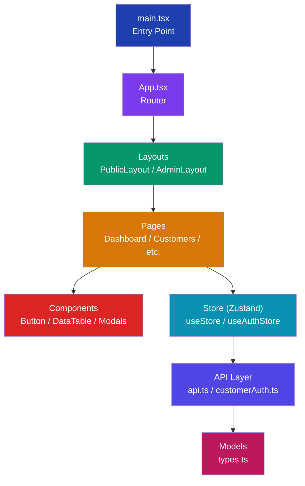

# 🎓 Master React + TypeScript — Using Your POPNA Project

Your project is a **real-world ISP management app** built with an excellent tech stack. Here's a structured roadmap to understand every pattern in this codebase — from zero to mastery.

---

## 📋 Your Tech Stack

| Technology | Version | What It Does |
|---|---|---|
| **React** | 18.3 | UI library (components, hooks, JSX) |
| **TypeScript** | 5.5 | Static typing for JavaScript |
| **Vite** | 5.3 | Build tool & dev server |
| **React Router** | 6.26 | Client-side routing |
| **Zustand** | 4.5 | Lightweight state management |
| **Axios** | 1.7 | HTTP API client |
| **TailwindCSS** | 3.4 | Utility-first CSS framework |
| **Lucide React** | 0.344 | Icon library |

---

## 🗺️ Learning Roadmap (10 Levels)

### Level 1: TypeScript Fundamentals
**Study file:** [types.ts](file:///f:/Projects/popna-react/src/models/types.ts)

This file is your **TypeScript textbook**. Every core TS concept lives here:

#### 1.1 — Type Aliases (Line 1)
```typescript
export type Provider = 'GTPL' | 'BSNL' | 'Railwire' | 'Krishiinet';
```
- `type` creates a named type
- `'GTPL' | 'BSNL'` is a **union of string literals** — the variable can ONLY be one of these exact strings
- If you try `const x: Provider = 'Random'`, TypeScript will throw an error at compile time

**🧪 Try this:** Add a new provider `'Jio'` to the `Provider` type. Notice how TypeScript immediately flags any code that doesn't handle the new value.

#### 1.2 — Interfaces (Lines 24-34)
```typescript
export interface Plan {
  id: number;
  planName: string;
  price: number;
  gstRate: number;
  description: string;
}
```
- `interface` defines the **shape** of an object
- Every property has a name and a type
- Think of it as a blueprint — any object claiming to be a `Plan` must have ALL these fields

#### 1.3 — Optional Properties (`?`) (Lines 51, 55)
```typescript
export interface Customer {
  password?: string;      // ? means this field is optional
  description?: string;
  gstin?: string | null;  // can be string, null, or entirely absent
}
```
- `password?: string` means the field can be `string` or `undefined`
- `gstin?: string | null` is a **triple union**: can be `string`, `null`, or `undefined`

#### 1.4 — Nested Interfaces (Lines 36-42 used in Line 57)
```typescript
export interface Address {
  line1: string;
  city: string;
  state: string;
}

export interface Customer {
  address: Address;  // Using another interface as a type
}
```
Interfaces can reference other interfaces — this is **composition**.

#### 1.5 — Inline Object Types (Line 148)
```typescript
gstBreakup: { cgst?: number; sgst?: number; igst?: number };
```
Instead of creating a separate interface, you can define the shape **inline**.

**📚 Key Takeaway:** `interface` defines object shapes, `type` creates type aliases. Both enforce compile-time safety. Your `types.ts` is the **single source of truth** for all data shapes in the app.

---

### Level 2: Project Structure & Configuration
**Study files:** [tsconfig.json](file:///f:/Projects/popna-react/tsconfig.json), [vite.config.ts](file:///f:/Projects/popna-react/vite.config.ts), [main.tsx](file:///f:/Projects/popna-react/src/main.tsx)

#### 2.1 — tsconfig.json (Compiler Options)
```json
{
  "strict": true,              // Enables ALL strict type checking
  "noUnusedLocals": true,      // Error on unused variables
  "noUnusedParameters": true,  // Error on unused function params
  "jsx": "react-jsx",          // Enables JSX without importing React
  "paths": { "@/*": ["./src/*"] }  // Path alias: @/ → src/
}
```

> [!IMPORTANT]
> `"strict": true` is the most important setting. It enables `strictNullChecks`, `noImplicitAny`, and more. **Never turn this off** — it's what makes TypeScript actually useful.

#### 2.2 — Path Aliases (`@/`)
Throughout the codebase you'll see:
```typescript
import { Customer } from '@/models/types';
```
Instead of `'../../models/types'`. This is configured in both `tsconfig.json` and `vite.config.ts`.

#### 2.3 — main.tsx (App Entry Point)
```typescript
ReactDOM.createRoot(rootEl).render(
  <React.StrictMode>
    <ErrorBoundary>
      <BrowserRouter>
        <App />
      </BrowserRouter>
    </ErrorBoundary>
  </React.StrictMode>
);
```
- `StrictMode` — catches bugs by running effects twice in dev
- `ErrorBoundary` — catches render errors gracefully
- `BrowserRouter` — enables client-side routing

---

### Level 3: React Components & Props
**Study files:** [Button.tsx](file:///f:/Projects/popna-react/src/components/ui/Button.tsx), [ProtectedRoute.tsx](file:///f:/Projects/popna-react/src/components/ProtectedRoute.tsx)

#### 3.1 — Typed Props with Interface
```typescript
interface ButtonProps extends React.ButtonHTMLAttributes<HTMLButtonElement> {
  variant?: 'primary' | 'secondary' | 'outline' | 'ghost' | 'destructive';
  size?: 'sm' | 'md' | 'lg';
}
```
- `extends React.ButtonHTMLAttributes<HTMLButtonElement>` means this component accepts ALL native button props (`onClick`, `disabled`, etc.) **plus** your custom ones
- This is called **interface extension/inheritance**

#### 3.2 — React.FC (Function Component Type)
```typescript
const Button: React.FC<ButtonProps> = ({ children, variant = 'primary', ...props }) => {
  // ...
};
```
- `React.FC<ButtonProps>` says "this is a React function component that accepts ButtonProps"
- `variant = 'primary'` — **default parameter** (if no variant is passed, use 'primary')
- `...props` — **spread operator** collects all remaining props

#### 3.3 — Children & ReactNode
```typescript
interface ProtectedRouteProps {
  children: React.ReactNode;       // Any renderable content
  allowedRoles?: UserRole[];       // Optional array of roles
  customerOnly?: boolean;
}
```
- `React.ReactNode` is the type for anything React can render: elements, strings, numbers, null, arrays
- `UserRole[]` means "array of UserRole values"

#### 3.4 — Destructuring Props
```typescript
const ProtectedRoute = ({ children, allowedRoles, customerOnly }: ProtectedRouteProps) => {
```
The `{ children, allowedRoles, customerOnly }` syntax **destructures** the props object. The `: ProtectedRouteProps` tells TypeScript the type.

**🧪 Try this:** Open `Button.tsx` and add a new variant `'warning'`. You'll need to:
1. Add `'warning'` to the union type in `ButtonProps`
2. Add a CSS class mapping in the `variants` object
3. TypeScript will guide you — if something is missing, it tells you!

---

### Level 4: React Hooks (useState, useEffect)
**Concept overview — these are used everywhere in your pages:**

#### 4.1 — useState with Types
```typescript
const [search, setSearch] = useState<string>('');
const [selectedPlan, setSelectedPlan] = useState<Plan | null>(null);
const [complaints, setComplaints] = useState<Complaint[]>([]);
```
- `useState<string>('')` — state is a string, starts as `''`
- `useState<Plan | null>(null)` — state is either a Plan object or null
- `useState<Complaint[]>([])` — state is an array of Complaints

#### 4.2 — useEffect for Side Effects
```typescript
useEffect(() => {
  fetchPlans();          // API call runs after component mounts
}, []);                  // [] = only run once on mount

useEffect(() => {
  filterResults(search); // Runs every time 'search' changes
}, [search]);            // [search] = dependency array
```

#### 4.3 — Event Handlers
```typescript
const handleSubmit = (e: React.FormEvent<HTMLFormElement>) => {
  e.preventDefault();
  // ...
};

const handleChange = (e: React.ChangeEvent<HTMLInputElement>) => {
  setSearch(e.target.value);
};
```
- `React.FormEvent` — for form submissions
- `React.ChangeEvent<HTMLInputElement>` — for input changes
- These types give you autocomplete for `e.target`, `e.currentTarget`, etc.

---

### Level 5: Routing (React Router v6)
**Study file:** [App.tsx](file:///f:/Projects/popna-react/src/App.tsx)

#### 5.1 — Route Structure
```tsx
<Routes>
  {/* Public Routes — nested inside PublicLayout */}
  <Route path="/" element={<PublicLayout />}>
    <Route index element={<HomePage />} />
    <Route path="plans" element={<PlansPage />} />
  </Route>

  {/* Protected Admin Routes */}
  <Route path="/admin" element={<ProtectedRoute><AdminLayout /></ProtectedRoute>}>
    <Route path="dashboard" element={...} />
  </Route>
</Routes>
```

Key concepts:
- **Nested Routes** — child routes render inside parent's `<Outlet />`
- **Layout Routes** — `PublicLayout` and `AdminLayout` wrap their children
- **Index Routes** — `<Route index>` matches the parent path exactly
- **Navigate** — `<Navigate to="..." replace />` for redirects

#### 5.2 — Protected Routes Pattern
Your `ProtectedRoute` component shows **role-based access control (RBAC)**:
```tsx
<ProtectedRoute allowedRoles={['admin']}>
  <AdminSettings />
</ProtectedRoute>
```
If the user isn't authenticated or doesn't have the right role → redirect!

---

### Level 6: State Management with Zustand
**Study files:** [useStore.ts](file:///f:/Projects/popna-react/src/store/useStore.ts), [useAuthStore.ts](file:///f:/Projects/popna-react/src/store/useAuthStore.ts)

#### 6.1 — Creating a Typed Store
```typescript
interface AuthState {
  isAuthenticated: boolean;
  role: UserRole | null;
  username: string | null;
  login: (username: string, password: string) => boolean;
  logout: () => void;
}

export const useAuthStore = create<AuthState>((set) => ({
  isAuthenticated: false,
  role: null,
  login: (username, password) => {
    // ... validation logic
    set({ isAuthenticated: true, role, username });
    return true;
  },
}));
```
- `create<AuthState>` — the **generic parameter** tells Zustand the shape of the store
- `set()` — updates the state (like setState but for the whole store)
- The interface defines **both data AND methods** in one place

#### 6.2 — Using the Store in Components
```typescript
const { isAuthenticated, role } = useAuthStore();
```
That's it! No Provider wrapping, no Context boilerplate. Zustand is beautifully simple.

#### 6.3 — Store with Async Actions
```typescript
fetchPlans: async () => {
  set({ loading: true });
  try {
    const plans = await plansApi.getAll();
    set({ plans, loading: false });
  } catch (error) {
    set({ error: 'Failed to fetch', loading: false });
  }
},
```
The store handles loading states, error states, and data — all typed.

---

### Level 7: API Layer & Async TypeScript
**Study files:** [api.ts](file:///f:/Projects/popna-react/src/api/api.ts), [customerAuth.ts](file:///f:/Projects/popna-react/src/api/customerAuth.ts)

#### 7.1 — Typed API Responses
```typescript
export interface CustomerAuthResponse {
  success: boolean;
  customerId?: number;
  customerMobile?: string;
  message?: string;
}

export const loginCustomer = async (
  mobile: string,
  password: string
): Promise<CustomerAuthResponse> => {
  // ...
};
```
- `async` function → automatically returns a `Promise`
- `Promise<CustomerAuthResponse>` — when awaited, gives you a `CustomerAuthResponse`
- TypeScript enforces that EVERY code path returns the correct shape

#### 7.2 — Error Handling Pattern
```typescript
let customers: Customer[] = [];
try {
  customers = await customersApi.getAll();
} catch (error) {
  try {
    const stored = localStorage.getItem('customers-data');
    if (stored) customers = JSON.parse(stored);
    else customers = mockCustomers;
  } catch (e) {
    customers = mockCustomers;
  }
}
```
This shows a **fallback chain**: API → localStorage → mock data.

---

### Level 8: Generics (Advanced TypeScript)
**Study file:** [DataTable.tsx](file:///f:/Projects/popna-react/src/components/ui/DataTable.tsx)

This is where TypeScript gets **powerful**:

```typescript
interface Column<T> {
  key: string;
  header: string;
  render?: (item: T) => React.ReactNode;
}

interface DataTableProps<T> {
  data: T[];
  columns: Column<T>[];
  onRowClick?: (item: T) => void;
}

export function DataTable<T extends { id: number | string }>({
  data, columns, onRowClick
}: DataTableProps<T>) {
```

- `<T>` is a **generic type parameter** — it's a placeholder for "any type"
- `T extends { id: number | string }` — **constraint**: T must have an `id` property
- When you use `<DataTable data={customers} ...>`, TypeScript **infers** that T = Customer
- Now `render` function knows `item` is a `Customer`, and you get full autocomplete!

**🧪 Try this:** Use `DataTable` with your `Plan[]` data. Notice how TypeScript automatically knows the column render functions receive `Plan` objects.

---

### Level 9: Utility Patterns
**Study file:** [utils.ts](file:///f:/Projects/popna-react/src/lib/utils.ts)

#### 9.1 — The `cn()` Pattern
```typescript
import { clsx, type ClassValue } from 'clsx';
import { twMerge } from 'tailwind-merge';

export function cn(...inputs: ClassValue[]): string {
  return twMerge(clsx(inputs));
}
```
- `...inputs` — **rest parameter** (accepts any number of arguments)
- `ClassValue[]` — type imported from clsx (strings, objects, arrays, etc.)
- Combines `clsx` (conditional classes) + `twMerge` (resolves Tailwind conflicts)

#### 9.2 — Union Types in Function Parameters
```typescript
export function formatDateDMY(date: Date | string | number): string {
```
Accepts three different input types, returns always a string. TypeScript ensures you handle all cases.

#### 9.3 — Partial<T> (Built-in Utility Type)
Used in your store:
```typescript
updateCompanyProfile: (profile: Partial<CompanyProfile>) => Promise<void>
```
- `Partial<CompanyProfile>` makes ALL properties of `CompanyProfile` optional
- So you can pass just `{ companyName: 'New Name' }` instead of the full object

---

### Level 10: Architecture Patterns Summary



| Layer | Files | Purpose |
|---|---|---|
| **Models** | `types.ts` | All TypeScript interfaces & types |
| **API** | `api.ts`, `customerAuth.ts`, etc. | HTTP calls with typed responses |
| **Store** | `useStore.ts`, `useAuthStore.ts` | Global state (Zustand) |
| **Pages** | `pages/admin/`, `pages/public/` | Full page components |
| **Components** | `components/ui/`, `components/` | Reusable UI pieces |
| **Layouts** | `layouts/` | Page shells (sidebar, nav, footer) |
| **Lib** | `lib/utils.ts` | Helper functions |

---

## 🎯 Study Plan (Recommended Order)

| Week | Focus | Files to Study | What You'll Learn |
|---|---|---|---|
| **1** | TypeScript Basics | `types.ts`, `utils.ts` | Interfaces, types, unions, optionals |
| **2** | Components & Props | `Button.tsx`, `Card.tsx`, `Input.tsx` | Props, React.FC, event types |
| **3** | Routing | `App.tsx`, `ProtectedRoute.tsx`, `main.tsx` | Routes, navigation, guards |
| **4** | State Management | `useAuthStore.ts`, `useStore.ts` | Zustand, global state, async actions |
| **5** | API Layer | `api.ts`, `customerAuth.ts`, `invoices.ts` | Axios, async/await, error handling |
| **6** | Pages & Forms | `Login.tsx`, `Customers.tsx` | Forms, validation, CRUD operations |
| **7** | Advanced Components | `DataTable.tsx`, modals | Generics, complex props, composition |
| **8** | Full Feature | Build something new! | Apply everything together |

---

## 💡 Practice Challenges

1. **Beginner:** Add a new field `area: string` to the `Customer` interface and display it in the customers page
2. **Intermediate:** Create a new reusable `Badge` component with typed props (`variant`, `size`, `children`)
3. **Advanced:** Add a new Zustand store for notifications with typed actions (`addNotification`, `dismiss`, `clearAll`)
4. **Expert:** Build a complete new page (e.g., "Vendors") with CRUD operations, using `DataTable`, modals, and the API layer

---

## 🔑 TypeScript Cheat Sheet (From Your Codebase)

```typescript
// ── Type Alias ──
type Provider = 'GTPL' | 'BSNL';              // Union of literals

// ── Interface ──
interface Plan { id: number; name: string; }   // Object shape

// ── Optional ──
password?: string;                              // string | undefined

// ── Extending ──
interface ButtonProps extends React.ButtonHTMLAttributes<HTMLButtonElement> {}

// ── Generic ──
function DataTable<T extends { id: number }>(props: { data: T[] }) {}

// ── Utility Types ──
Partial<Customer>    // All fields optional
Promise<Plan[]>      // Async result type
React.ReactNode      // Any renderable content
React.FC<Props>      // Function component with typed props

// ── Event Types ──
React.FormEvent<HTMLFormElement>
React.ChangeEvent<HTMLInputElement>
React.MouseEvent<HTMLButtonElement>
```

> [!TIP]
> **The #1 way to learn:** Read a file, then try modifying it. TypeScript's error messages are your best teacher — they tell you exactly what's wrong and what's expected!
